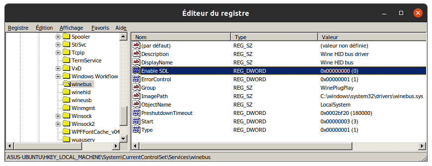

# SuuntoLinkWine

#### Un moyen de synchroniser et de configurer votre montre Suunto sous Linux...


[Click here for English version.](README.md)

***

<br>

### 1 - Installer Wine :

*Vous devez avoir au moins la version **6.6 de Wine** pour pouvoir installer .NET 4.5*  
*Vous devez avoir aussi une version **Wine-Staging** sans quoi le programme d'installation de SuuntoLink ne voudra pas s'exécuter (erreur de droits administrateur).*

La meilleure façon est d'installer la dernière version de Wine fournie par WINE-HQ : regardez [ici pour les différentes distributions Linux](https://wiki.winehq.org/Download "Wine-HQ for Linux").

*Pour la suite, la méthode expliquée fonctionne sur mon **Ubuntu 20.04**. Vous devrez sûrement adapter certaines étapes selon votre distribution Linux.*

<br>

#### :heavy_check_mark: Vérification :

```console
wine --version
```

La commande retourne la version de Wine installée sur votre système, par exemple : `wine-7.1 (Staging)` sur mon Ubuntu.

***

<br>

### 2 - Installer Winetricks :

*Winetricks est un script qui vous facilitera l'installation de certains logiciels sous Wine.*

Une installation rapide (pas très propre) peut être faite par les commandes suivantes :

```console
wget  https://raw.githubusercontent.com/Winetricks/winetricks/master/src/winetricks
chmod +x winetricks
sudo mv winetricks /usr/bin/
```

<br>

#### :heavy_check_mark: Vérification :

```console
winetricks --version
```

La commande retourne la version de Winetricks installée sur votre système, par exemple : `20210206-next` sur mon Ubuntu.

***

<br>

### 3 - Changez les droits sur les périphériques HID :

*Une montre Suunto branchée sur un système Linux apparaît dans `/dev/hidrawX` (X étant le numéro du périphérique HID correspondant à votre montre).*

*Par défaut, seul l'utilisateur **root** possède les droits de lecture/écriture sur le périphérique.*

Pour **créer automatiquement un règle** qui affectera les bons droits sur votre montre Suunto, nous utiliserons le script proposé par [@openambitproject](https://github.com/openambitproject)  (merci aux auteurs).

*J'en fait une copie [ici](libambit.rules) au cas où...*

L'installation se fait par les commandes suivantes :

```console
sudo wget https://raw.githubusercontent.com/JmB11/SuuntoLinkWine/main/libambit.rules -O /etc/udev/rules.d/libambit.rules
sudo udevadm control --reload-rules && udevadm trigger
```

<br>

#### :heavy_check_mark: Vérification :

Branchez votre **montre Suunto en USB**, puis :

```console
ls -l /dev/hidraw*
```

La commande liste les périphériques HID ; le **dernier périphérique branché** (votre montre) doit apparaître avec les droits suivants :<br>
`crw-rw-rw- 1 root root`.

***

<br>

### 4 - Préparer Wine :

Choisissez une architecture d'exécution **32 bits** pour Wine grâce à la commande :

```console
export WINEARCH="win32"
```
<!-- export WINEPREFIX="/home/USERNAME/.suunto" -->

Installez ensuite .NET 4.5 à l'aide de **Winetricks** par la commande :

```console
winetricks dotnet45
```

*Si Wine vous demande d'installer "Mono", vous pouvez annuler.<br>
Si Wine vous demande de redémarrer après l'installation de .NET, choisissez "Redémarrer ultérieurement".*

Choisissez une version **Windows 7** pour l'exécution de Wine par la commande :

```console
winetricks win7
```

Pour désactiver l'utilisation de SDL avec les périphériques HID, il faut ajouter **Enable SDL** dans la base de registres de Wine grâce à la commande :

```console
wine reg add 'HKLM\System\CurrentControlSet\Services\WineBus' /v 'Enable SDL' /t REG_DWORD /d 0 /f
```

<br>

#### :heavy_check_mark: Vérification :

```console
wine regedit
```

Dans l'éditeur de base de registres de Wine, recherchez la clé : `HKLM\System\CurrentControlSet\Services\WineBus`.<br>
Vérifiez que la valeur DWORD `Enable SDL` est bien présente et vaut `0x00000000 (0)` :



***

<br>

### 5 - Installer SuuntoLink  :

Vous pouvez télécharger et installer la dernière version de SuuntoLink directement par :

```console
wget -P ~/.wine/drive_c/ https://suuntolink.static.movescount.com/Suuntolink_installer.exe
wine ~/.wine/drive_c/Suuntolink_installer.exe
```

Si l'installation se déroule bien et que votre montre est connectée et reconnue, vous devriez arrivez à l'écran de connexion :


#### :thumbsup: Et voilà !


***

<br>

### 6 - Créer un lanceur (Optionnel)  :

Pour Ubuntu, vous pouvez créer un lanceur pour SunntoLink :

```console
gedit ~/.local/share/applications/SuuntoLink.desktop
```

Entrez ceci dans le code du lanceur :

```desktop
[Desktop Entry]
Version=1.0
Type=Application
Terminal=false
Icon=/home/USERNAME/.wine/drive_c/users/USERNAME/AppData/Local/Suuntolink/app-4.0.2/resources/app/icons/icon@4x.png
Name=Suuntolink
Exec=sh -c "wineserver -k; cd /home/USERNAME/.wine/drive_c/users/USERNAME/AppData/Local/Suuntolink; wine Suuntolink.exe >/dev/null 2>&1"
Comment=Suunto Ambit
```

:warning: Remplacez les 4 instances **USERNAME** dans ce fichier par votre **identifiant Linux** !

*La commande `wineserver -k` permet de "tuer" les éventuels processus Wine qui seraient en cours d’exécution au cas où SuuntoLink aurait planté auparavant...*

***

<br>

### Bug connu :

L'économiseur d'écran fige l'actualisation des données avec la montre. Si cela se produit, il suffit de **débrancher et rebrancher** la montre.

Dans le pire des cas, **fermez l'application et redémarrez le lanceur** (avec la commande `wineserver -k` tout devrait bien se passer :sunglasses: ).
