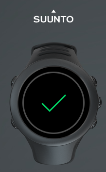
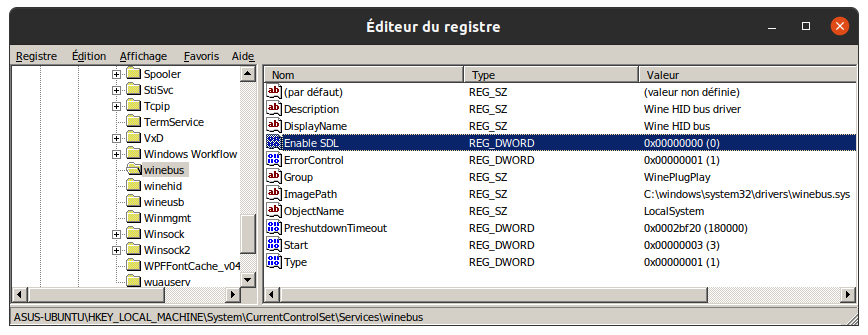
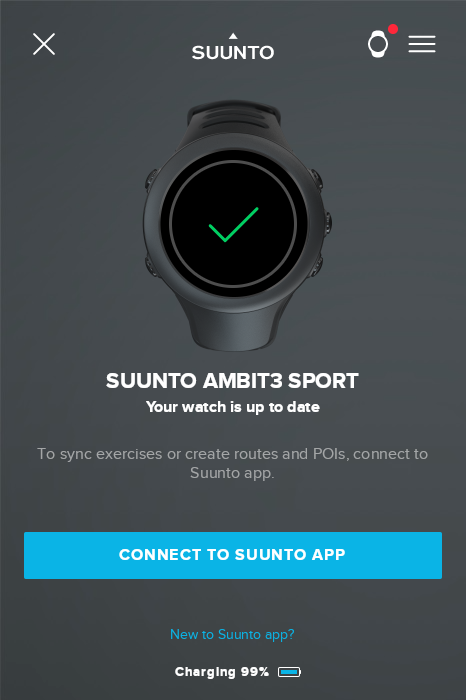

# SuuntoLinkWine

#### A way to sync and configure your Suunto watch on Linux...




[Cliquez ici pour la version Française.](LISEZMOI.md)

***

<br>

### 1 - Install Wine :

*You must have at least **Wine 6.6** version to be able to install .NET 4.5*<br>
*You must also have a **Wine-Staging** version otherwise the SuuntoLink installer will run (administrator rights error).*

The best way is to install the latest version of Wine provided by WINE-HQ : see [here for various Linux distros](https://wiki.winehq.org/Download "Wine-HQ for Linux").

*For the following, the explained method works on my **Ubuntu 20.04**. You should have to adapt certain steps according to your Linux distribution.*

<br>

#### :heavy_check_mark: Check :

```console
wine --version
```

The command returns Wine version installed on your system, for example: `wine-7.1 (Staging)` on my Ubuntu.

***

<br>

### 2 - Install Winetricks :

*Winetricks is a script that will help you install certain software under Wine.*

A quick (not very clean) installation can be done by the following commands :

```console
wget  https://raw.githubusercontent.com/Winetricks/winetricks/master/src/winetricks
chmod +x winetricks
sudo mv winetricks /usr/bin/
```

<br>

#### :heavy_check_mark: Check :

```console
winetricks --version
```

The command returns Winetricks version installed on your system, for example : `20210206-next` on my Ubuntu.

***

<br>

### 3 - Change HID devices rights :

*A Suunto watch plugged into a Linux system appears in `/dev/hidrawX` (where X is the HID device number corresponding to your watch).*

*By default, only **root** user has read/write permissions needed on the device.*

To **automatically create a rule** that will set the good rights to your Suunto watch, we will use the script proposed by [@openambitproject](https://github.com/openambitproject)  (thanks to authors).

*I've made a copy [here](libambit.rules) just in case...*

The installation is done by the following commands :

```console
sudo wget https://raw.githubusercontent.com/JmB11/SuuntoLinkWine/main/libambit.rules -O /etc/udev/rules.d/libambit.rules
sudo udevadm control --reload-rules && udevadm trigger
```

<br>

#### :heavy_check_mark: Check :

Plug your **Suunto watch via USB**, then :

```console
ls -l /dev/hidraw*
```

The command lists HID devices ; the  **last connected device** (your watch) should appear with the following rights :<br>
`crw-rw-rw- 1 root root`.

***

<br>

### 4 - Prepare Wine :

Choose a **32 bits** runtime architecture for Wine with the command :

```console
export WINEARCH="win32"
```
<!-- export WINEPREFIX="/home/USERNAME/.suunto" -->

Then install .NET 4.5 using **Winetricks** using the command :

```console
winetricks dotnet45
```

*If Wine asks you to install "Mono", you can cancel.<br>
If Wine asks you to restart after installing .NET, choose "Restart later".*

Choose a **Windows 7** version for running Wine with the command :

```console
winetricks win7
```

To disable the use of SDL with HID devices, you have to add  **Enable SDL** to the Wine registry using the command :

```console
wine reg add 'HKLM\System\CurrentControlSet\Services\WineBus' /v 'Enable SDL' /t REG_DWORD /d 0 /f
```

<br>

#### :heavy_check_mark: Check :

```console
wine regedit
```

In Wine's registry editor, find the key : `HKLM\System\CurrentControlSet\Services\WineBus`.<br>
Check that the DWORD value `Enable SDL` is present and set to `0x00000000 (0)` :



***

<br>

### 5 - Install SuuntoLink  :

You can download and install the latest version of SuuntoLink directly by :

```console
wget -P ~/.wine/drive_c/ https://suuntolink.static.movescount.com/Suuntolink_installer.exe
wine ~/.wine/drive_c/Suuntolink_installer.exe
```

If the installation goes well and your watch is connected and recognized, you should arrive to login screen :



#### :thumbsup: Et voila !


***

<br>

### 6 - Create a launcher (Optional) :

For Ubuntu, you can create a launcher to start SunntoLink :

```console
gedit ~/.local/share/applications/SuuntoLink.desktop
```

Enter this in the launcher code :

```desktop
[Desktop Entry]
Version=1.0
Type=Application
Terminal=false
Icon=/home/USERNAME/.wine/drive_c/users/USERNAME/AppData/Local/Suuntolink/app-4.0.2/resources/app/icons/icon@4x.png
Name=Suuntolink
Exec=sh -c "wineserver -k; cd /home/USERNAME/.wine/drive_c/users/USERNAME/AppData/Local/Suuntolink; wine Suuntolink.exe >/dev/null 2>&1"
Comment=Suunto Ambit
```

:warning: Replace the 4 **USERNAME** in this file with your **Linux Login** !

*The command  `wineserver -k` allows you to "kill" any Wine processes that might be running if SuuntoLink has eventually crashed before...*

***

<br>

### Known Bug :

The screen saver freezes data refreshing with the watch. If this occurs, simply **unplug and plug back in** your watch.

In the worst case, **close the application and restart the launcher ** (with the command `wineserver -k` everything should be fine :sunglasses: ).
